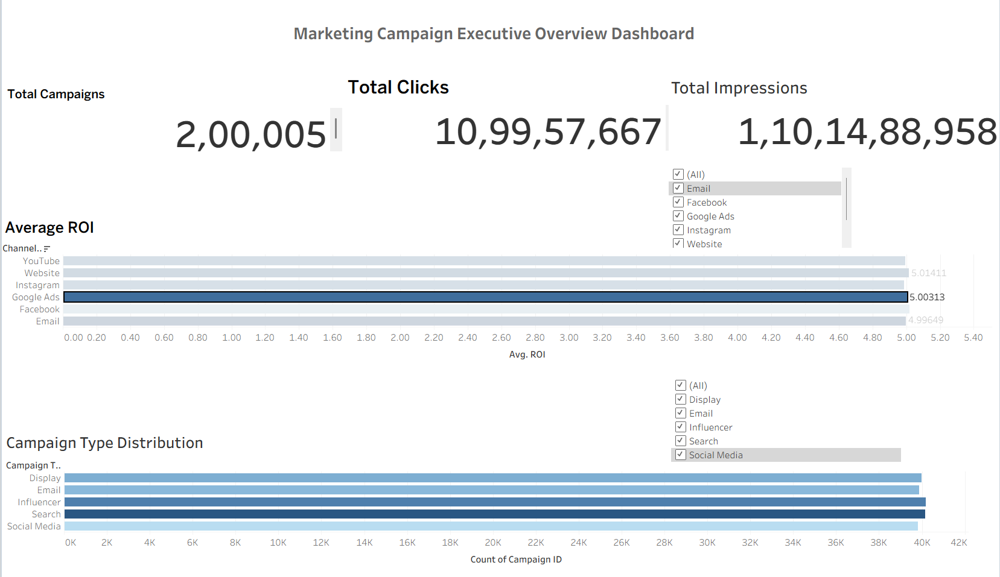
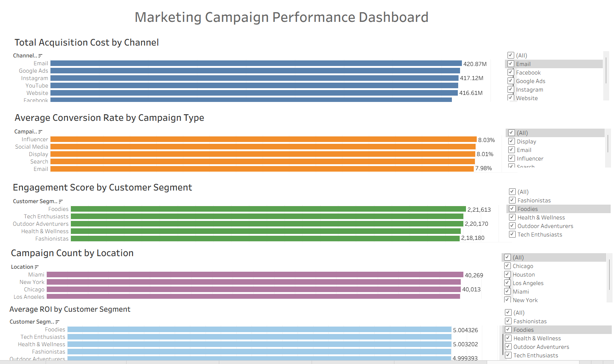

# 📊 Marketing Campaign Performance Analytics

A complete end-to-end Data Analytics project that analyzes marketing campaign performance using **Python, MySQL, SQL, and Tableau**.

The project focuses on cleaning marketing data, performing SQL analysis, and building interactive Tableau dashboards to provide business insights.

---

## 📌 Project Overview

This project analyzes marketing campaigns across different channels such as Email, Facebook, Google Ads, Instagram, Website, and YouTube.

The workflow includes:

- Data Cleaning using Python
- Data Import into MySQL
- SQL Analysis
- Interactive Tableau Dashboards
- Business Insights

---

## 🛠 Tech Stack

- Python
- Pandas
- NumPy
- MySQL
- SQL
- Tableau Public
- Jupyter Notebook

---

## 📂 Project Structure

```
Marketing-Campaign-Performance/
│
├── data/
│   └── marketing_campaign_dataset.csv
│
├── notebooks/
│   ├── marketing_analysis.ipynb
│   └── import_to_mysql.py
│
├── sql/
│   └── marketing_queries.sql
│
├── tableau/
│   ├── dashboard1.twb
│   └── dashboard2.twb
│
├── images/
│   ├── dashboard1.png
│   └── dashboard2.png
│
└── README.md
```

---

# 📊 Data Cleaning

The dataset was cleaned using Python.

Cleaning steps performed:

- Removed duplicate records
- Removed missing values
- Converted Date column to DateTime format
- Verified data consistency
- Exported cleaned dataset

---

# 🗄 MySQL Database

Database Name

```
marketing_campaign_db
```

Table Name

```
marketing_campaign
```

Data was imported into MySQL using Python SQLAlchemy.

---

# 📈 SQL Analysis

The project contains 15 SQL queries including:

- Total Campaigns
- Total Clicks
- Total Impressions
- Average ROI
- Campaign Count
- Average Conversion Rate
- Acquisition Cost by Channel
- Customer Segment Analysis
- Campaign Count by Location
- Top Performing Campaigns
- Overall Performance Summary

---

# 📊 Tableau Dashboard 1

## Executive Overview Dashboard

### KPIs

- Total Campaigns
- Total Clicks
- Total Impressions

### Charts

- Average ROI by Channel
- Campaign Type Distribution

### Filters

- Channel Used
- Campaign Type

---

## Dashboard Preview



---

# 📊 Tableau Dashboard 2

## Marketing Campaign Performance Dashboard

### Charts

- Total Acquisition Cost by Channel
- Average Conversion Rate by Campaign Type
- Engagement Score by Customer Segment
- Campaign Count by Location
- Average ROI by Customer Segment

### Filters

- Channel Used
- Campaign Type
- Customer Segment
- Location

---

## Dashboard Preview



---

# 📊 Business Insights

- Google Ads generated one of the highest acquisition costs.
- Conversion rates remain nearly consistent across campaign types.
- Customer engagement varies across customer segments.
- ROI is relatively stable across marketing channels.
- Campaign distribution is balanced among campaign types.

---
---

## 📥 Why Python Was Used for MySQL Import

The marketing campaign dataset contains approximately **200,000 records**, making it inefficient to import using manual SQL `INSERT` statements. Initially, `LOAD DATA LOCAL INFILE` was attempted in MySQL Workbench, but it failed due to local file access restrictions.

To overcome this issue, a Python script (`import_to_mysql.py`) was developed using **Pandas**, **SQLAlchemy**, and **PyMySQL**. The script reads the cleaned CSV file and efficiently uploads the entire dataset into the MySQL database using `df.to_sql()`. This approach is faster, more reliable, and better suited for handling large datasets.


# ▶️ How to Run

## Clone Repository

```bash
git clone https://github.com/YourUsername/Marketing-Campaign-Performance.git
```

---

## Install Libraries

```bash
pip install pandas numpy sqlalchemy pymysql
```

---

## Run Python

```bash
python import_to_mysql.py
```

---

## Execute SQL

Open MySQL Workbench

Run

```
marketing_queries.sql
```

---

## Open Tableau

Open

```
dashboard1.twb
```

or

```
dashboard2.twb
```

Refresh the data source if required.

---

# 📌 Future Improvements

- Power BI Dashboard
- Predictive Analytics using Machine Learning
- Marketing ROI Forecasting
- Customer Segmentation using Clustering
- Automated Dashboard Refresh

---

# 👨‍💻 Author

**Santhosh V**

AI & Data Science Student

Saveetha Engineering College

---

## ⭐ If you found this project useful, give it a Star!
